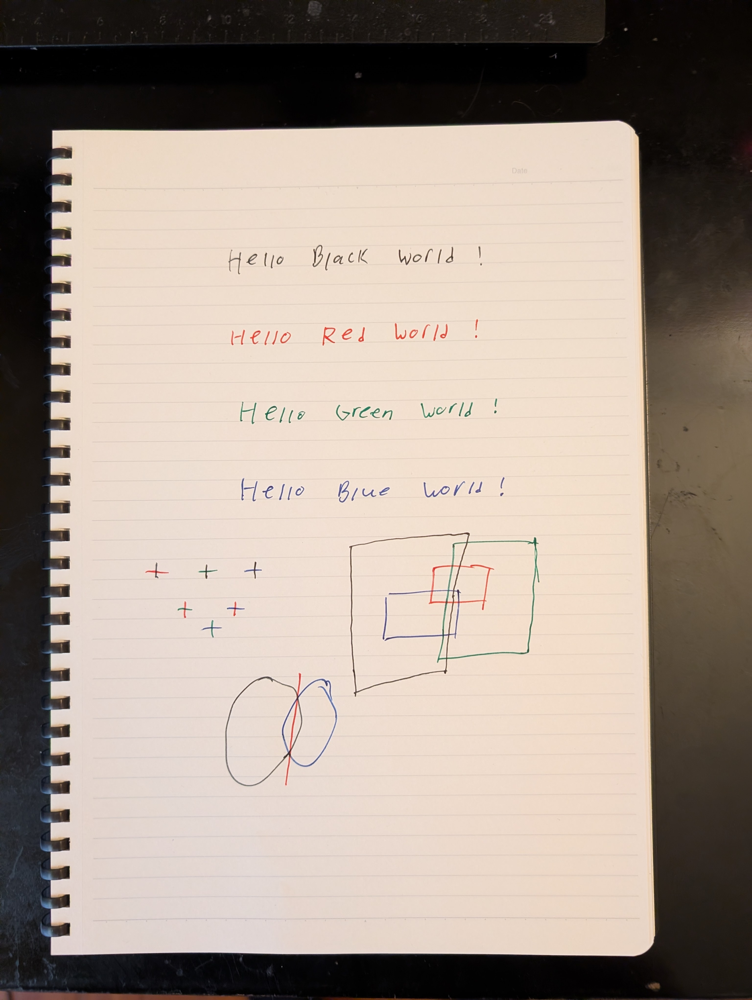
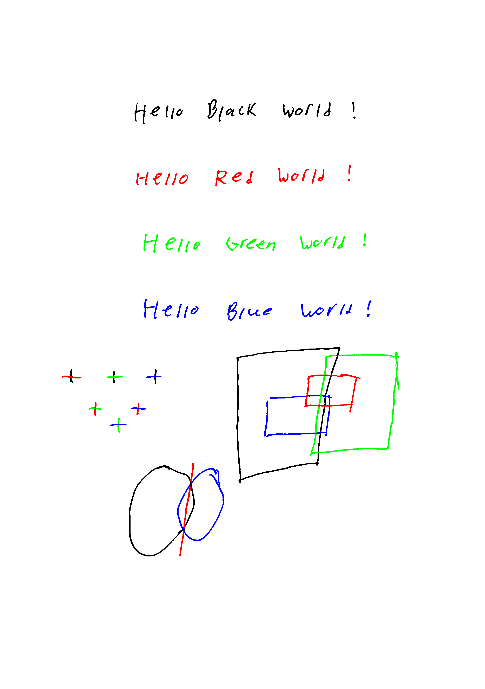
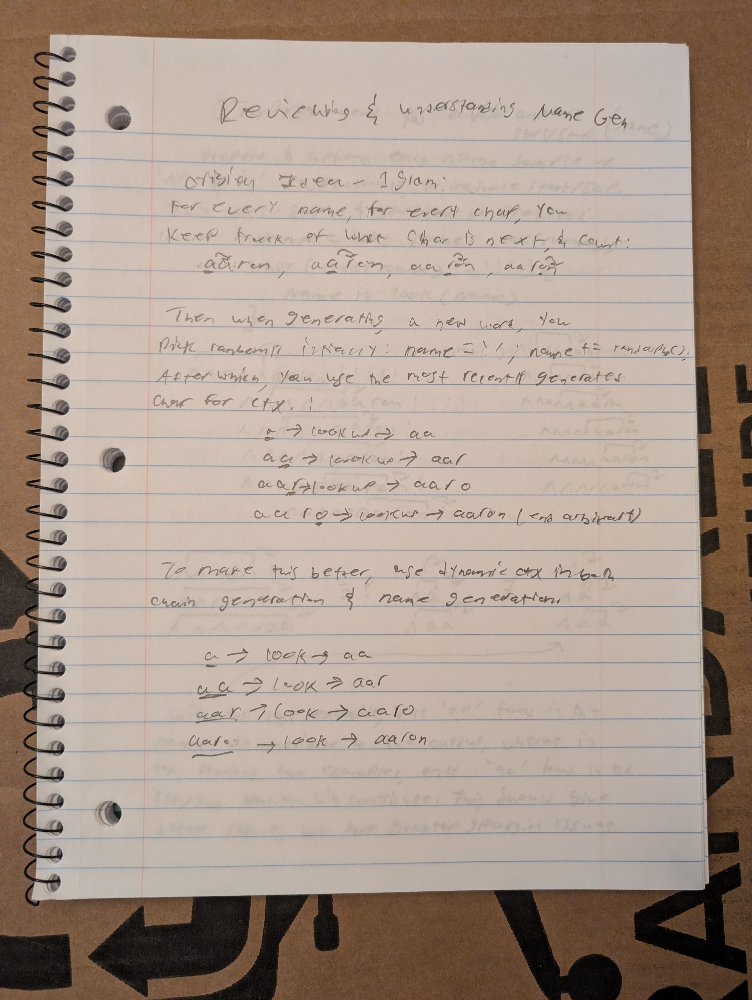
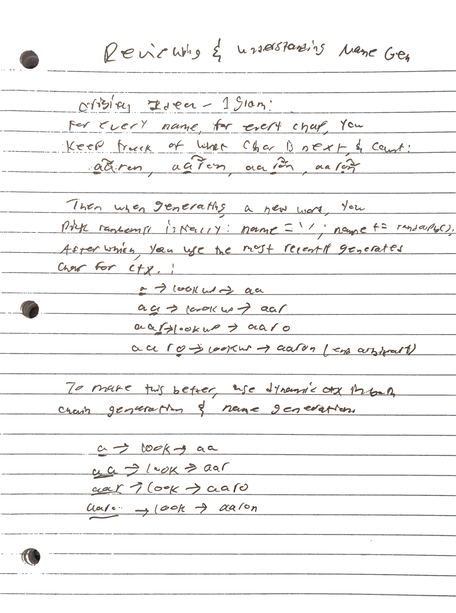
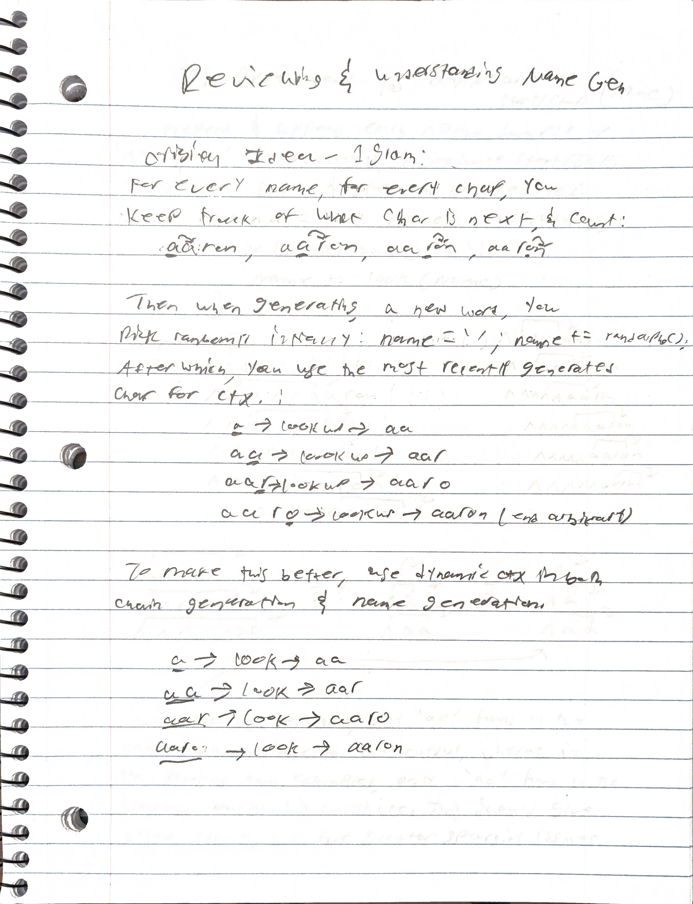

# Notebook-Scanner
## Background
On [my website](https://eiron.xyz/) I'd like to incorporate more diagrams and drawings to make my article explanations clearer. However, I find drawing things out with a mouse to be such a pain that I won't do it, even though it looks much better than a drawing on paper. As such I developed this program as a way to digitize my notebook paper drawings; they look much better digitized and it provides me the ability to easily rearrange things if need be.

While my main use-case is for digitizing diagrams, it also works quite well as a normal scanner with results comparable to Google's scanner (i'm not making the bold claim that it's as good as Google's, but for scanning notebooks it's comparable).

## Test Image Results
| Original Image | Scanned Output |
| :---: | :---: |
|  |  |

| Original Image | Scanned Output |
| :---: | :---: |
|  |  |

| My Scanner | Google Scanner |
| :---: | :---: |
|  |  |

## Using the Program
### Color Limitations
Only the colors of pure black, red, blue, and green are supported by the program. This is simply because I don't have a need for more than this, however you could pretty easily modify the k-means++ classifier to support more colors.

### Image Taking Recommendations
If you want only the writing and not the notebook lines scanned, you may have some trouble depending on your notebook paper; my primary notebook happens to have relatively light horizontal lines which makes the process easier. If you have thick lines I'd recomend writing in pen, as well as taking your picture close enough so no auto-cropping is needed. You will also probably need to use manual mode (flag explained below).

### Example of Running the Program
```
python3 scan.py test_images/test-color.jpg --colors r,g,b,bl --output test_color_output
```

### Program Flags
| Flag | Description | Default |
| :--- | :--- | :---: |
| `--output` | **string** <br> Output image filename (saves as `.png`). | `ink` |
| `--manual` | **bool** <br> Opens an interactive window with a slider to manually select the brightness threshold. <br> • `s`: Confirm selection <br> • `q`: Quits program. | `False` |
| `--transparent` | **bool** <br> Saves the output `.png` image with a transparent background instead of a white one. | `False` |
| `--crop_only` | **bool** <br> Only performs the perspective warp/cropping to the notebook paper; skips all further image processing. | `False` |
| `--colors` | **tuple** <br> Specify which pen colors are present. <br> Arguments: `r`, `g`, `b`, `bl` (Red, Green, Blue, Black). | `bl` |
| `--ink` | **string** <br> Determines how black writing is processed: <br> • `og`: Samples original ink colors <br> • `gray`: Converts ink to grayscale <br> • `bw`: Forces pure black <br> • `std`: Standard processed ink | `std` |
| `--help`, `-h` | Show the help message and exit. | — |
